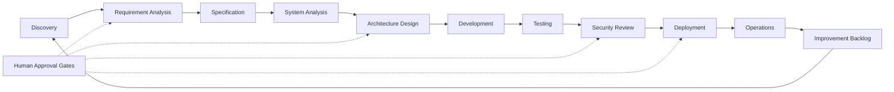

# Introduction

AI-assisted engineering works best when it is treated as an operating model, not a collection of disconnected tools. This playbook defines a practical approach for using AI across software delivery while preserving engineering judgment, security discipline, and human accountability.

The goal is not to replace engineers. The goal is to help teams move faster through well-defined collaboration patterns: humans provide intent, context, priorities, and review; AI agents help analyze systems, draft implementation work, generate documentation, inspect defects, and accelerate repetitive engineering tasks.

## Principles

Effective AI engineering programs share a few durable principles:

- **Human accountability remains explicit.** Every AI-assisted change has an accountable owner.
- **Context quality drives output quality.** Teams should invest in clear specifications, repository conventions, examples, and decision records.
- **Security and privacy are design constraints.** Sensitive data, credentials, customer records, and proprietary material require deliberate handling.
- **AI output is reviewed like any other engineering work.** Generated code, documentation, infrastructure, and analysis should pass normal review and validation.
- **Automation should be observable.** Teams should be able to understand what an agent did, why it did it, and what evidence supports the result.

## Delivery Flow Diagram

The AI-assisted delivery flow keeps humans accountable while allowing AI to accelerate analysis, drafting, validation, and documentation.

## AI-Assisted Software Development Lifecycle

Use AI throughout the software delivery lifecycle as a governed accelerator. The table below defines the expected inputs, activities, outputs, responsible roles, and AI usage at each stage.

| Stage | Inputs | AI-Assisted Activities | Outputs | Responsible Roles |
| --- | --- | --- | --- | --- |
| Discovery | Product goals, customer feedback, support tickets, analytics | Summarize themes, identify opportunities, draft problem statements | Opportunity brief, initial risks, open questions | Product owner, engineering manager |
| Requirement Analysis | Product brief, business rules, stakeholder notes | Clarify ambiguity, draft acceptance criteria, identify dependencies | Refined requirements, acceptance criteria, assumptions log | Product owner, system analyst |
| Specification | Requirements, constraints, existing standards | Generate specification drafts, workflow narratives, edge-case lists | Implementation-ready specification, review checklist | System analyst, architect, product owner |
| System Analysis | Existing codebase, data flows, APIs, logs | Map impacted components, identify integration points, summarize current behavior | Impact analysis, affected systems, risk notes | System analyst, senior engineers |
| Architecture Design | Requirements, non-functional needs, platform constraints | Compare design options, draft architecture notes, model trade-offs | Architecture decision record, diagrams, interface contracts | Solution architect, platform architect |
| Development | Specification, architecture, repository context | Draft code, refactor, generate tests, update docs | Pull request, test updates, implementation notes | Developers, technical leads |
| Testing | Acceptance criteria, test strategy, changed code | Generate test cases, expand coverage, inspect failures | Test suite updates, defect findings, coverage notes | QA, developers |
| Security Review | Threat model, diff, dependencies, infrastructure changes | Identify risky patterns, review permissions, check secret exposure | Security findings, remediation plan, approval notes | Security auditor, service owner |
| Deployment | Release plan, CI/CD pipeline, infrastructure plan | Draft deployment notes, validate runbooks, summarize rollback steps | Release notes, deployment checklist, rollback plan | DevOps engineer, release owner |
| Operations | Logs, metrics, incidents, runbooks | Summarize incidents, suggest runbook updates, detect recurring issues | Post-incident notes, runbook improvements, backlog items | Operations owner, service team |

AI may assist at every stage, but approval remains with the accountable human role. High-risk stages such as security review, infrastructure changes, and production deployment require explicit human approval gates.

## AI Component Model

A complete AI engineering environment is made of several layers that work together:

| Layer | Purpose | Examples | Primary Controls |
| --- | --- | --- | --- |
| LLM Layer | Provides reasoning, generation, summarization, and tool-use capability | Claude, GPT, Gemini, local models | Model approval, data policy, cost controls, context limits |
| AI IDE Layer | Brings AI into the developer workflow | Claude Code, Cursor, OpenCode, Windsurf, Cline | Workspace permissions, repo context, command approval |
| Agent Layer | Defines specialized roles for delivery work | System Analyst, Solution Architect, Developer, QA, Security, DevOps | Role definitions, expected inputs/outputs, review scope |
| Skill and Template Layer | Provides reusable procedures and domain guidance | AITMPL templates, agent skills, CLAUDE.md | Version control, ownership, review, provenance |
| MCP Layer | Connects agents to external systems and tools | GitHub, Terraform, AWS, Kubernetes, Vercel, Supabase | Least privilege, audit logs, credential management |
| CI/CD Layer | Automates validation, summaries, and governance checks | GitHub Actions, deployment pipelines, release automation | Branch protection, status checks, audit trail |

This model helps teams decide where a capability belongs. For example, coding conventions belong in CLAUDE.md, reusable task procedures belong in AITMPL templates or skills, and external system access belongs behind governed MCP integrations.

## LLM Selection Considerations

Choose models based on the work being performed, the data being processed, and the controls required by the organization.

| Consideration | Guidance |
| --- | --- |
| Task fit | Use stronger reasoning models for architecture, security, and complex refactoring; use lower-cost models for summaries and routine drafting. |
| Context window | Match context size to the task. Large codebase analysis, multi-file design, and incident review require more context than focused edits. |
| Cost | Track usage by workflow, repository, and team. Optimize prompts and templates before scaling high-volume automation. |
| Data sensitivity | Use only approved models and hosting arrangements for confidential, regulated, or customer data. Redact or synthesize examples where possible. |
| Latency | Interactive IDE workflows need fast responses; batch CI workflows can tolerate slower models when quality is materially better. |
| Auditability | Prefer tools that expose usage logs, prompt history, model versions, and integration activity for enterprise workflows. |

## Example AI Development Workflow

A typical governed workflow moves from requirement to release through explicit artifacts and approval gates.

| Step | Human Responsibilities | AI Responsibilities | Approval Gate | Artifact Produced |
| --- | --- | --- | --- | --- |
| Requirements | Define business outcome and constraints | Summarize goals, identify gaps, draft questions | Product owner accepts scope | Requirement brief |
| Specification | Confirm rules, edge cases, and acceptance criteria | Draft specification and testable criteria | Product and engineering review | Feature specification |
| Analysis | Validate impacted systems and dependencies | Inspect repository, map affected components | Technical lead review | Impact analysis |
| Architecture | Choose design and integration approach | Compare options, draft ADR, identify trade-offs | Architecture gate | ADR and interface contract |
| Development | Implement, review, and own the change | Draft code, tests, docs, and PR summary | Peer review | Pull request |
| Testing | Confirm expected behavior and regression coverage | Generate test scenarios, inspect failures | Quality gate | Test results and coverage notes |
| Security | Review risk and approve mitigations | Flag risky patterns, permissions, and data exposure | Security gate | Security review notes |
| Deployment | Approve release and rollback path | Draft deployment notes and runbook updates | Release gate | Release notes and rollback plan |
| Operations | Monitor service and learn from incidents | Summarize logs, incidents, and recurring issues | Service owner review | Runbook or backlog update |

## Audience

This playbook is intended for engineering managers, platform engineers, software engineers, architects, security teams, product owners, and delivery teams that want a shared standard for AI-assisted work.

## How To Use This Playbook

Use the governance pages to align on policy and ownership before scaling adoption. Use platform setup pages to configure a consistent local and team environment. Use agent and skill pages to shape repeatable workflows for delivery work. Use reference projects as starting points for applied implementation patterns.

The playbook should evolve with the organization. Treat it as a living engineering standard: update it when teams learn better prompting patterns, add approved integrations, refine review controls, or identify new risks.

---
*Last updated: 2026-06-21 | Version: 1.2*