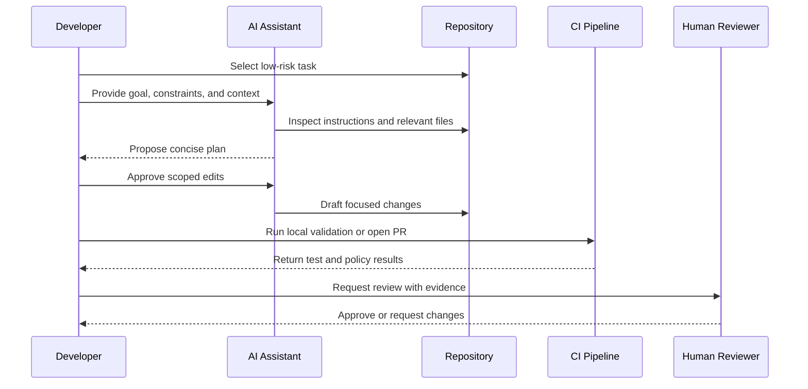

# First AI-Assisted PR

This guide helps a developer complete a first low-risk AI-assisted pull request using the playbook's governance, platform setup, agents, skills, and MCP guidance.

## Purpose

The first AI-assisted PR should prove that the developer environment works, the team review process is clear, and AI output can move through the normal engineering workflow without bypassing quality controls.

Choose a small task such as documentation cleanup, test improvement, minor refactoring, or a narrow bug fix. Avoid authentication, authorization, production infrastructure, payment flows, customer data, or deployment automation for the first exercise.

## Before You Start

Confirm that:

- You have read the governance and data handling guidance.
- Your AI IDE or Claude Code setup is approved for the repository.
- The repository has a current `CLAUDE.md` or equivalent project instruction file.
- Required dependencies install locally.
- Build and test commands are known.
- Any MCP integration you plan to use has an approved permission profile.

## Workflow Diagram



## Workflow

| Step | Action | Evidence |
| --- | --- | --- |
| 1. Select task | Pick a small, low-risk issue or documentation improvement | Issue link or short task statement |
| 2. Confirm context | Read `CLAUDE.md`, relevant docs, and nearby code | Notes in PR description |
| 3. Choose support | Select the agent, skill, and MCP tools needed for the task | Agent/skill names in PR notes |
| 4. Ask for plan | Have AI inspect context and propose a concise plan | Plan reviewed by developer |
| 5. Apply changes | Let AI draft changes in small increments | Commit history or diff |
| 6. Validate locally | Run tests, docs build, lint, or focused checks | Command output summarized |
| 7. Review diff | Inspect every changed file before opening PR | Developer review complete |
| 8. Open PR | Explain intent, AI assistance, validation, and risks | Pull request description |
| 9. Request review | Assign human reviewers based on change type | Review approvals |
| 10. Retrospect | Capture one improvement to prompts, docs, or workflow | Follow-up note or backlog item |

## Suggested First Prompt

```text
I want to make a small, low-risk AI-assisted PR in this repository.
First inspect the project instructions and relevant files.
Then propose a short plan before editing anything.

Task:
<describe the task>

Constraints:
- Keep the change focused.
- Do not modify unrelated files.
- Do not use secrets or production data.
- Run or recommend the most relevant validation command.
- Summarize the final diff and any remaining risk.
```

## Pull Request Checklist

Before requesting review, confirm:

- The PR has a clear description.
- AI assistance is disclosed where required by team policy.
- The diff is focused and reviewable.
- Tests or validation commands are listed.
- Sensitive data was not pasted into prompts or committed.
- Required reviewers are assigned.
- Any generated content was checked for accuracy.

## When To Stop And Ask For Help

Pause the work and ask a human reviewer when:

- The AI proposes broad refactoring unrelated to the task.
- The task touches secrets, identity, infrastructure, or production configuration.
- Generated code appears plausible but you cannot explain it.
- Tests fail and the cause is unclear.
- MCP access exposes more data or permissions than expected.

## Related Pages

- [Governance](../01-governance/governance.md) — the rules your PR must follow
- [CLAUDE.md](claude-md.md) — project instructions the AI reads
- [Junior Developer Quick Start](junior-developer-quickstart.md) — your safe first path
- [Agent and Skill Selection Guide](../03-agents/agent-skill-selection.md) — which agent to use
- [Backend Developer](../03-agents/backend-developer.md) — for server-side tasks
- [Frontend Developer](../03-agents/frontend-developer.md) — for UI tasks
- [MCP Setup](mcp.md) — external integrations
- [AI Troubleshooting](ai-troubleshooting.md) — when things go wrong

---
*Last updated: 2026-06-21 | Version: 1.1*