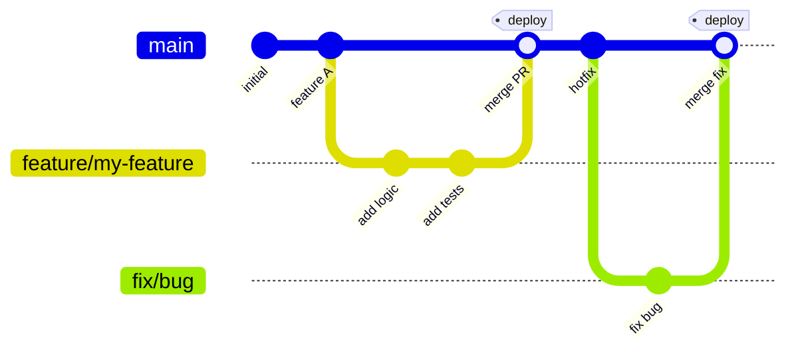
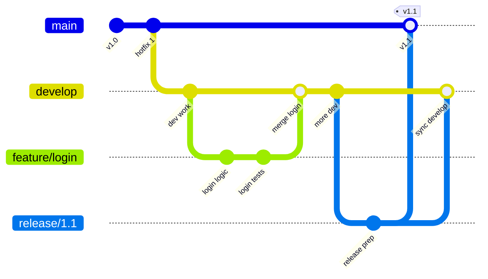
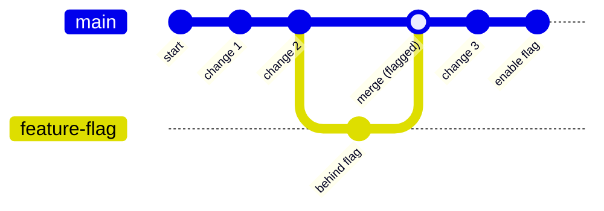

# Git Daily Usage

This page covers the Git commands developers use most often. It is organized by task, not by command, so you can find what you need based on what you are trying to do.

## Branch Strategy

### GitHub Flow (Recommended)

Simple, short-lived branches. Best for continuous delivery teams.



**Rules:**
- `main` is always deployable
- All work happens in feature branches
- Feature branches are short-lived (hours to days, not weeks)
- Merge via pull request with review
- Deploy from main after merge

**Branch naming:**
```
feature/description
fix/description
docs/description
chore/description
```

### Git Flow (Long-Running Releases)

More structure. Best for teams with scheduled releases, multiple versions, or maintenance branches.



**Branches:**
| Branch | Purpose | Lifetime |
|--------|---------|----------|
| `main` | Production-ready code | Permanent |
| `develop` | Integration branch | Permanent |
| `feature/*` | New features | Short-lived |
| `release/*` | Release preparation | Short-lived |
| `hotfix/*` | Production fixes | Short-lived |

### Trunk-Based Development

Everyone commits to main (or short-lived branches merged within hours). Best for teams with strong CI/CD and feature flags.



**Rules:**
- Branches live < 1 day
- Use feature flags for incomplete work
- CI must pass before merge
- No long-lived feature branches

### Choosing a Strategy

| Team Situation | Recommended Strategy |
|---|---|
| Continuous delivery, small team | GitHub Flow |
| Scheduled releases, multiple versions | Git Flow |
| Strong CI/CD, feature flags | Trunk-Based |
| New team, unsure | GitHub Flow (simplest) |

## Starting Work

### Clone a Repository

```bash
git clone <url>
git clone <url> <folder-name>
git clone --depth 1 <url>          # shallow clone (faster, no history)
```

### Create a Branch

```bash
git checkout -b <branch-name>      # create and switch to new branch
git switch -c <branch-name>        # modern alternative (Git 2.23+)
git checkout -b <branch> origin/main  # branch from remote main
```

### Switch Branches

```bash
git checkout <branch-name>
git switch <branch-name>           # modern alternative
git switch -                       # switch to previous branch
```

### Update Your Local Main

```bash
git checkout main
git pull origin main
```

## Checking Status

### See What Changed

```bash
git status                         # working tree status
git status -s                      # short format
git status --ignored               # show ignored files too
```

### See What You Changed

```bash
git diff                           # unstaged changes
git diff --staged                  # staged changes (what will be committed)
git diff main                      # all changes vs main
git diff main --stat               # summary of changes (files and line counts)
```

### See Commit History

```bash
git log                            # full log
git log --oneline                  # one line per commit
git log --oneline -10              # last 10 commits
git log --oneline --graph --all    # visual branch structure
git log --author="Your Name"       # your commits only
git log --since="2 weeks ago"      # recent commits
git log --grep="fix"               # commits matching a keyword
```

### See Who Changed What

```bash
git blame <file>                   # who changed each line
git blame -L 10,20 <file>          # blame specific lines
```

## Staging and Committing

### Stage Changes

```bash
git add <file>                     # stage a specific file
git add <folder>/                  # stage all files in a folder
git add -p                         # stage parts of a file interactively
git add .                          # stage all changes in current directory
git add -A                         # stage all changes in the entire repo
```

### Unstage Changes

```bash
git restore --staged <file>        # unstage a file (Git 2.23+)
git reset HEAD <file>              # unstage a file (older syntax)
```

### Commit

```bash
git commit -m "message"            # commit staged changes
git commit -am "message"           # stage and commit tracked files
git commit --amend                 # edit the last commit message
git commit --amend --no-edit       # add staged changes to last commit without editing message
git commit --amend -m "new msg"    # replace last commit message
```

### Commit Message Convention

Follow your team's convention. A common pattern:

```
type: short description

Longer explanation if needed. Wrap at 72 characters.

Fixes #123
```

Types: `feat`, `fix`, `docs`, `style`, `refactor`, `test`, `chore`

## Syncing with Remote

### Push

```bash
git push                           # push current branch
git push origin <branch>           # push specific branch
git push -u origin <branch>        # push and set upstream tracking
git push --force-with-lease        # safe force push (checks remote state)
```

### Pull

```bash
git pull                           # fetch and merge current branch
git pull --rebase                  # fetch and rebase (cleaner history)
git pull origin main               # pull specific branch
```

### Fetch

```bash
git fetch                          # fetch all remotes
git fetch origin                   # fetch origin only
git fetch --prune                  # remove stale remote-tracking branches
```

## Branch Management

### List Branches

```bash
git branch                         # local branches
git branch -r                      # remote branches
git branch -a                      # all branches
git branch -v                      # branches with last commit
git branch --merged main           # branches merged into main
git branch --no-merged main        # branches not yet merged
```

### Rename a Branch

```bash
git branch -m <new-name>           # rename current branch
git branch -m <old> <new>          # rename specific branch
```

### Delete a Branch

```bash
git branch -d <branch>             # delete merged branch
git branch -D <branch>             # force delete (even if unmerged)
git push origin --delete <branch>  # delete remote branch
git push origin :<branch>          # delete remote branch (alternative)
```

### Clean Up Local Branches

```bash
git fetch --prune                  # remove stale remote-tracking branches
git branch -vv | grep ': gone]'    # find branches whose remote is gone
git branch --merged main | grep -v main | xargs git branch -d  # delete merged branches
```

## Undoing Changes

### Discard Working Changes

```bash
git restore <file>                 # discard changes to a file (Git 2.23+)
git checkout -- <file>             # discard changes (older syntax)
git restore .                      # discard all unstaged changes
git clean -fd                      # remove untracked files and directories
git clean -fdn                     # dry run (show what would be removed)
```

### Undo the Last Commit

```bash
git reset --soft HEAD~1            # undo commit, keep changes staged
git reset HEAD~1                   # undo commit, keep changes unstaged
git reset --hard HEAD~1            # undo commit AND discard changes (dangerous)
```

### Revert a Commit (Safe)

```bash
git revert <commit-hash>           # create a new commit that undoes the change
git revert HEAD                    # revert the last commit
git revert HEAD~3..HEAD            # revert last 3 commits (one revert commit each)
```

### Recover a Deleted Branch

```bash
git reflog                         # find the commit the branch pointed to
git checkout -b <branch> <hash>    # recreate the branch
```

## Stashing

### Save Work Temporarily

```bash
git stash                          # stash staged and unstaged changes
git stash -u                       # stash including untracked files
git stash -m "description"         # stash with a message
git stash --patch                  # stash interactively (choose hunks)
```

### List Stashes

```bash
git stash list                     # list all stashes
git stash list --stat              # list with file summary
```

### Apply Stashes

```bash
git stash pop                      # apply most recent stash and remove it
git stash apply                    # apply most recent stash (keep it)
git stash apply stash@{2}          # apply specific stash
git stash drop stash@{0}           # delete a stash
git stash clear                    # delete all stashes
```

## Merging and Rebasing

### Merge

```bash
git merge <branch>                 # merge branch into current branch
git merge --no-ff <branch>         # merge with a merge commit (no fast-forward)
git merge --abort                  # abort a conflicted merge
```

### Rebase

```bash
git rebase main                    # rebase current branch onto main
git rebase -i HEAD~3               # interactive rebase (edit last 3 commits)
git rebase --abort                 # abort a rebase
git rebase --continue              # continue after resolving conflicts
```

### Interactive Rebase Commands

When running `git rebase -i`, you can:

- `pick` — keep the commit as-is
- `reword` — keep commit, edit message
- `edit` — pause for amending
- `squash` — meld into previous commit
- `fixup` — like squash, discard this commit's message
- `drop` — remove the commit

### Cherry-Pick

```bash
git cherry-pick <commit-hash>      # apply a specific commit to current branch
git cherry-pick <hash1> <hash2>    # apply multiple commits
git cherry-pick <hash1>^..<hash2>  # apply a range of commits
git cherry-pick --abort            # abort a conflicted cherry-pick
```

## Resolving Conflicts

### During a Merge or Rebase

1. Open the conflicted file — look for `<<<<<<<`, `=======`, `>>>>>>>`
2. Edit the file to keep the correct code
3. Remove the conflict markers
4. Stage the resolved file: `git add <file>`
5. Continue: `git merge --continue` or `git rebase --continue`

### Useful Commands

```bash
git diff                           # see conflict markers
git checkout --ours <file>         # keep your version
git checkout --theirs <file>       # keep their version
git mergetool                      # open merge tool (if configured)
```

## Tags

### Create Tags

```bash
git tag v1.0.0                     # lightweight tag
git tag -a v1.0.0 -m "release"    # annotated tag
git tag -a v1.0.0 <commit-hash>   # tag a specific commit
```

### Push Tags

```bash
git push origin v1.0.0             # push a specific tag
git push origin --tags             # push all tags
```

### Delete Tags

```bash
git tag -d v1.0.0                  # delete local tag
git push origin --delete v1.0.0    # delete remote tag
```

## Searching

### Search Code

```bash
git grep "pattern"                 # search tracked files
git grep -n "pattern"              # show line numbers
git grep "pattern" -- '*.js'       # search specific file types
git log -S "functionName"          # find commits that added/removed a string
git log -G "regex"                 # find commits matching a regex
```

## Configuration

### Useful Aliases

```bash
git config --global alias.co checkout
git config --global alias.br branch
git config --global alias.st status
git config --global alias.lg "log --oneline --graph --all"
git config --global alias.last "log -1 HEAD"
git config --global alias.unstage "restore --staged"
git config --global alias.amend "commit --amend --no-edit"
```

### Set Defaults

```bash
git config --global user.name "Your Name"
git config --global user.email "you@example.com"
git config --global init.defaultBranch main
git config --global pull.rebase true
git config --global core.autocrlf input   # macOS/Linux
git config --global core.autocrlf true    # Windows
```

### View Configuration

```bash
git config --list                  # all config
git config --global --list         # global config
git config user.name               # specific value
```

## Working with Remote

### Remote Management

```bash
git remote                         # list remotes
git remote -v                      # list remotes with URLs
git remote add <name> <url>        # add a remote
git remote rename <old> <new>      # rename a remote
git remote remove <name>           # remove a remote
git remote set-url origin <url>    # change remote URL
```

### Multiple Remotes

```bash
git remote add upstream <url>      # add upstream remote
git fetch upstream                 # fetch from upstream
git merge upstream/main            # merge upstream changes
git push origin main               # push to your fork
```

## Common Workflows

### Feature Branch Workflow

```bash
git checkout main
git pull origin main
git checkout -b feature/my-feature
# ... make changes ...
git add .
git commit -m "feat: add my feature"
git push -u origin feature/my-feature
# ... create PR, get review, merge ...
git checkout main
git pull origin main
git branch -d feature/my-feature
```

### Fix a Bug

```bash
git checkout main
git pull origin main
git checkout -b fix/bug-description
# ... fix the bug ...
git add .
git commit -m "fix: description of the fix"
git push -u origin fix/bug-description
```

### Update Feature Branch with Latest Main

```bash
git checkout main
git pull origin main
git checkout feature/my-feature
git rebase main                    # rebase on top of latest main
# ... resolve conflicts if any ...
git push --force-with-lease        # update remote (safe force push)
```

### Undo a Published Commit

```bash
git revert <commit-hash>           # create a revert commit
git push                           # push the revert
```

### Clean Up After Merge

```bash
git checkout main
git pull origin main
git fetch --prune
git branch --merged main | grep -v main | xargs git branch -d
```

## AI-Assisted Git Usage

When working with AI assistants like Claude Code:

- Let AI generate commit messages from your diff: "Write a commit message for these changes"
- Ask AI to explain a merge conflict: "Explain this conflict and suggest a resolution"
- Use AI to write PR descriptions: "Summarize this PR for reviewers"
- Ask AI to find related commits: "Find commits related to this function"
- Let AI prepare a cherry-pick: "Which commits do I need to cherry-pick for this fix?"

## Quick Reference

| Task | Command |
|------|---------|
| Create branch | `git checkout -b <name>` |
| Stage all | `git add -A` |
| Commit | `git commit -m "msg"` |
| Push | `git push` |
| Pull | `git pull --rebase` |
| See status | `git status -s` |
| See log | `git log --oneline -10` |
| See diff | `git diff main` |
| Stash work | `git stash` |
| Undo commit | `git reset --soft HEAD~1` |
| Revert commit | `git revert <hash>` |
| Delete branch | `git branch -d <name>` |
| Clean up | `git fetch --prune` |

---

*Last updated: 2026-06-21 | Version: 1.1*
