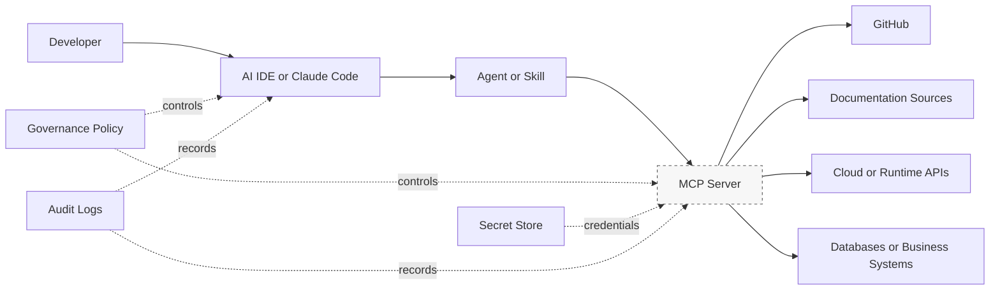

# MCP Setup

Model Context Protocol (MCP) provides a standard way for AI tools to connect with external systems such as repositories, documentation services, issue trackers, cloud platforms, databases, and internal knowledge bases. MCP makes AI agents more useful by giving them structured, permissioned access to context and actions.

## Setup Goals

A good MCP setup should be secure, auditable, and easy for developers to use. It should expose only the capabilities needed for approved workflows and should follow least-privilege access principles.

## MCP Trust Boundary Diagram

The MCP server is the main trust boundary. It should enforce authentication, scoped permissions, logging, and safe failure behavior before an AI tool can reach external systems.

## Planning Checklist

Before enabling an MCP server, confirm:

- The business purpose and expected users.
- The data the server can read.
- The actions the server can perform.
- Authentication and authorization requirements.
- Logging and audit expectations.
- Secret storage and rotation approach.
- Failure and rollback behavior.
- Support ownership.

## MCP Configuration Scope

MCP configuration defines what an AI workflow can reach. It should be scoped by environment, permission level, and business purpose.

| Scope Level | Applies To | Guidance |
| --- | --- | --- |
| User-level configuration | Individual developer tools and local experiments | Keep personal tokens and experiments out of shared repositories |
| Project-level configuration | Repository-approved MCP servers and settings | Commit only reviewed configuration that the team agrees to support |
| Team-level standard | Shared setup across related repositories or products | Use consistent naming, permission profiles, and validation steps |
| Organization-level catalog | Approved MCP servers, owners, and risk ratings | Require platform and security review before broad rollout |
| Environment-level access | Development, test, staging, production | Separate credentials and permissions by environment; production requires stronger approval |

Document each MCP server's owner, purpose, permission profile, required secrets, validation command, and rollback or disablement procedure.

## MCP Configuration Precedence

When multiple MCP settings or instructions apply, use this precedence:

| Priority | Source | Guidance |
| --- | --- | --- |
| 1 | Organization security and data policy | Defines which systems and data classes can be accessed |
| 2 | Approved MCP catalog or platform standard | Defines allowed servers, owners, and permission profiles |
| 3 | Environment-specific access rules | Defines dev, test, staging, and production boundaries |
| 4 | Repository MCP configuration | Defines the project-supported setup |
| 5 | User-level MCP configuration | May add personal convenience, but cannot expand approved access |
| 6 | Agent, skill, or prompt request | May request tool usage, but cannot override access policy |

If a user-level MCP configuration grants broader access than the repository or organization standard, use the narrower access. If the required MCP permission is unclear, default to read-only or pause for approval.
## Configuration Pattern

Most teams should manage MCP configuration through approved developer environment standards rather than one-off local setup. Recommended practices include:

- Document required environment variables.
- Use organization-managed credentials where possible.
- Avoid committing secrets or personal tokens.
- Provide a test command or smoke test.
- Maintain examples for common operating systems.
- Review tool permissions before enabling write actions.

## Common MCP Integration Patterns

The table below shows common MCP integrations. Those with dedicated setup pages in this playbook are linked. Others are listed as patterns teams may adopt with appropriate review.

| MCP Integration | Purpose | Typical Use Cases | Security Considerations | Setup Guide |
| --- | --- | --- | --- | --- |
| [GitHub MCP](../05-mcp/github.md) | Repository, issue, pull request, and workflow context | PR summaries, issue lookup, CI failure triage | Prefer read-only access; protect private issue and log content | [GitHub](../05-mcp/github.md) |
| [Terraform MCP](../05-mcp/terraform.md) | Infrastructure-as-code review and plan interpretation | Plan review, module analysis, drift investigation | Never auto-apply production plans; protect state and secrets | [Terraform](../05-mcp/terraform.md) |
| [AWS MCP](../05-mcp/aws.md) | Cloud resource inspection and operational analysis | IAM review, log summaries, inventory, cost investigation | Use short-lived, least-privilege roles; separate production access | [AWS](../05-mcp/aws.md) |
| [Docker MCP](../05-mcp/docker.md) | Container and image inspection | Dockerfile review, build diagnostics, image analysis | Limit host access; protect mounted volumes and env vars | [Docker](../05-mcp/docker.md) |
| [Context7 MCP](../05-mcp/context7.md) | Library and framework documentation lookup | API syntax checks, migration guidance, version-specific docs | No sensitive data exposure; verify docs match project versions | [Context7](../05-mcp/context7.md) |
| Kubernetes MCP | Cluster and workload inspection | Pod health, deployment state, event analysis, manifest review | Avoid broad cluster-admin access; redact secrets and config maps | Team-documented |
| Vercel MCP | Frontend deployment and project context | Deployment inspection, preview status, environment review | Protect environment variables and production deployment controls | Team-documented |

Add integrations incrementally. Start with read-only repository and documentation integrations before enabling cloud, database, or production operations.

## MCP Permission Profiles

Use permission profiles to make access decisions explicit and repeatable.

| Profile | Allowed Capabilities | Typical Use | Approval Expectation |
| --- | --- | --- | --- |
| Read-only | Read repository, issue, documentation, cloud, or runtime metadata | Analysis, summaries, troubleshooting, documentation | Team lead or platform-approved default |
| Review/comment | Read context and add comments, summaries, or review notes | Pull request summaries, issue triage, release notes | Repository maintainer approval |
| Sandbox write | Create or update resources only in sandbox environments | Tool validation, training exercises, non-production experiments | Platform or environment owner approval |
| Production read | Inspect production configuration, logs, metrics, or status without mutation | Incident support, operational review, compliance evidence | Service owner approval with audit trail |
| Production write | Create, update, delete, deploy, or mutate production systems | Exceptional operational workflows only | Explicit change approval; normally avoided for AI-assisted workflows |

Start with read-only access. Promote to broader profiles only when the workflow has a clear business need, documented controls, and an accountable owner.
## Security Considerations

MCP servers can significantly increase an AI agent's reach. Treat them as integration points with real operational risk. Review access scopes carefully, prefer read-only access by default, and require explicit approval for tools that can create, update, delete, deploy, or send messages.

## Validation

After setup, verify that the AI client can discover the server, call a harmless read-only tool, and handle errors cleanly. Document the validation steps so new users can confirm their environment quickly.

---
*Last updated: 2026-06-21 | Version: 1.3*