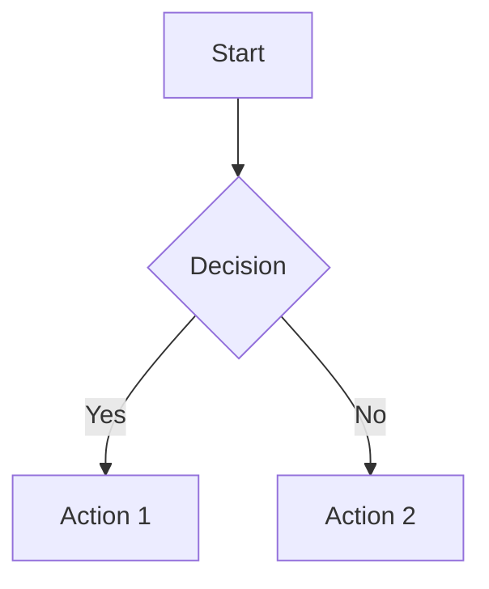
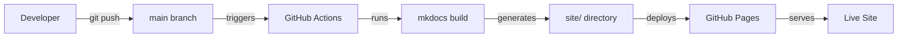
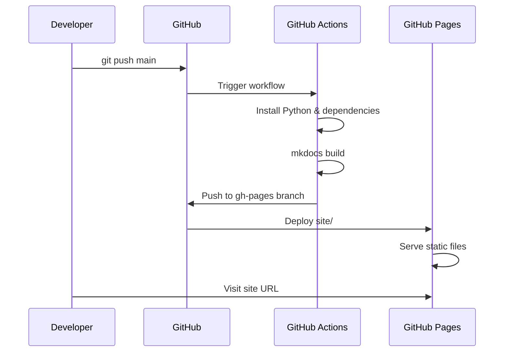
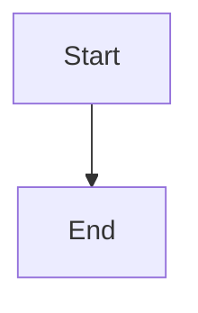

# MkDocs and GitHub Pages Guide

This page is the single reference for setting up, configuring, and maintaining the playbook's MkDocs site with GitHub Pages deployment. It covers local development, MkDocs configuration, theme customization, Markdown extensions, and the full GitHub Pages deployment pipeline.

## MkDocs Overview

MkDocs is a static site generator that converts Markdown files into a hosted documentation site. This playbook uses [Material for MkDocs](https://squidfunk.github.io/mkdocs-material/), a feature-rich theme with navigation, search, code highlighting, and Mermaid diagram support.

### Project Structure

```
ai-engineering-playbook/
├── docs/                          # Markdown source files
│   ├── index.md                   # Homepage
│   ├── glossary.md                # Glossary
│   ├── 01-governance/             # Governance section
│   ├── 02-platform-setup/         # Platform setup section
│   ├── 03-agents/                 # Agent definitions
│   ├── 04-skills/                 # Skill definitions
│   ├── 05-mcp/                    # MCP integrations
│   ├── 06-reference-projects/     # Reference projects
│   └── 07-spec-driven-sdlc/       # Spec-driven SDLC
├── mkdocs.yml                     # MkDocs configuration
├── requirements.txt               # Python dependencies
├── site/                          # Generated output (gitignored)
├── .github/workflows/
│   └── deploy-docs.yml            # GitHub Actions deployment
└── .gitignore                     # Ignores site/, .venv/, etc.
```

### Key Files

| File | Purpose |
|------|---------|
| `mkdocs.yml` | All site configuration: theme, nav, extensions, plugins |
| `docs/` | All Markdown source content |
| `requirements.txt` | Python package dependencies |
| `.github/workflows/deploy-docs.yml` | CI/CD pipeline for deployment |
| `site/` | Generated HTML output (auto-generated, do not edit) |

## Local Development

### Prerequisites

- Python 3.8+
- pip (Python package manager)

### First-Time Setup

```bash
# Clone the repository
git clone https://github.com/ChanOoDev/ai-engineering-playbook.git
cd ai-engineering-playbook

# Create virtual environment
python -m venv .venv

# Activate virtual environment
# macOS/Linux:
source .venv/bin/activate
# Windows:
.venv\Scripts\activate

# Install dependencies
pip install -r requirements.txt
```

### Daily Commands

```bash
# Start local development server (live reload at localhost:8000)
mkdocs serve

# Build the site (generates site/ directory)
mkdocs build

# Build with strict mode (fails on warnings)
mkdocs build --strict

# Deploy to GitHub Pages (if using mkdocs deploy)
mkdocs deploy
```

### Virtual Environment

```bash
# Activate
source .venv/bin/activate        # macOS/Linux
.venv\Scripts\activate           # Windows

# Deactivate
deactivate

# Install new package
pip install <package>
pip freeze > requirements.txt    # Update requirements
```

## mkdocs.yml Configuration

The `mkdocs.yml` file controls everything about the site. Here's the full annotated configuration:

### Site Metadata

```yaml
site_name: AI Engineering Playbook
site_description: Team AI-Driven Development Guide
site_author: Engineering Team
```

| Field | Purpose |
|-------|---------|
| `site_name` | Displayed in the browser tab and header |
| `site_description` | Used for SEO and social sharing |
| `site_author` | Used for SEO metadata |

### Theme Configuration

```yaml
theme:
  name: material
  features:
    - navigation.tabs           # Top-level sections as tabs
    - navigation.sections       # Section headers in sidebar
    - navigation.expand         # Expand all sidebar items
    - search.highlight          # Highlight search terms
    - search.suggest            # Search autocomplete
    - content.code.copy         # Copy button on code blocks
```

| Feature | What It Does |
|---------|--------------|
| `navigation.tabs` | Shows top-level sections (Governance, Platform Setup, etc.) as tabs in the header |
| `navigation.sections` | Groups sidebar items under section headers |
| `navigation.expand` | Expands all sidebar items by default |
| `search.highlight` | Highlights matching terms in search results |
| `search.suggest` | Shows search suggestions as you type |
| `content.code.copy` | Adds a copy button to all code blocks |

### Additional Theme Options

```yaml
theme:
  name: material
  palette:
    - scheme: default           # Light mode
      primary: indigo
      accent: indigo
      toggle:
        icon: material/brightness-7
        name: Switch to dark mode
    - scheme: slate             # Dark mode
      primary: indigo
      accent: indigo
      toggle:
        icon: material/brightness-4
        name: Switch to light mode
  font:
    text: Roboto
    code: Roboto Mono
  icon:
    repo: fontawesome/brands/github
```

### Plugins

```yaml
plugins:
  - search                       # Built-in search
  - awesome-pages                # Automatic page ordering
```

| Plugin | Purpose |
|--------|---------|
| `search` | Enables full-text search across all pages |
| `awesome-pages` | Allows `.pages` files for automatic nav ordering |

### Markdown Extensions

```yaml
markdown_extensions:
  - admonition                   # !!! note, !!! warning, !!! tip blocks
  - pymdownx.superfences:        # Fenced code blocks with Mermaid support
      custom_fences:
        - name: mermaid
          class: mermaid
          format: !!python/name:pymdownx.superfences.fence_code_format
  - pymdownx.details             # Collapsible admonition blocks
  - pymdownx.highlight           # Code syntax highlighting
  - pymdownx.inlinehilite        # Inline code highlighting
  - tables                       # Markdown tables
  - toc:                         # Table of contents
      permalink: true            # Add anchor links to headings
```

| Extension | What It Does | Example |
|-----------|--------------|---------|
| `admonition` | Creates styled callout boxes | `!!! note "Title"` |
| `pymdownx.superfences` | Enables fenced code blocks and Mermaid diagrams | ` ```mermaid ` |
| `pymdownx.details` | Collapsible sections | `??? note "Click to expand"` |
| `pymdownx.highlight` | Syntax highlighting for code blocks | ` ```python ` |
| `pymdownx.inlinehilite` | Highlights inline code | `` `code` `` |
| `tables` | Enables Markdown tables | `| col1 | col2 |` |
| `toc` | Auto-generates table of contents with anchor links | `## Heading` → `#heading` |

### Navigation

```yaml
nav:
  - Home: index.md
  - Glossary: glossary.md

  - Governance:
      - Introduction: 01-governance/introduction.md
      - Governance: 01-governance/governance.md
      - Ownership Matrix: 01-governance/ownership-matrix.md
      - Adoption Roadmap: 01-governance/adoption-roadmap.md

  - Platform Setup:
      - Claude Code: 02-platform-setup/claude-code.md
      # ... more pages
```

**Navigation structure:**
- Top-level items appear as tabs (with `navigation.tabs` feature)
- Nested items appear in the sidebar
- The order in `nav` determines the display order
- All pages must be listed explicitly (no auto-discovery without `awesome-pages`)

### Full mkdocs.yml

```yaml
site_name: AI Engineering Playbook
site_description: Team AI-Driven Development Guide
site_author: Engineering Team

theme:
  name: material
  features:
    - navigation.tabs
    - navigation.sections
    - navigation.expand
    - search.highlight
    - search.suggest
    - content.code.copy

plugins:
  - search
  - awesome-pages

markdown_extensions:
  - admonition
  - pymdownx.superfences:
      custom_fences:
        - name: mermaid
          class: mermaid
          format: !!python/name:pymdownx.superfences.fence_code_format
  - pymdownx.details
  - pymdownx.highlight
  - pymdownx.inlinehilite
  - tables
  - toc:
      permalink: true

nav:
  - Home: index.md
  - Glossary: glossary.md

  - Governance:
      - Introduction: 01-governance/introduction.md
      - Governance: 01-governance/governance.md
      - Ownership Matrix: 01-governance/ownership-matrix.md
      - Adoption Roadmap: 01-governance/adoption-roadmap.md

  - Platform Setup:
      - Claude Code: 02-platform-setup/claude-code.md
      - First AI-Assisted PR: 02-platform-setup/first-ai-assisted-pr.md
      - Junior Developer Quick Start: 02-platform-setup/junior-developer-quickstart.md
      - Git Daily Usage: 02-platform-setup/git-daily-usage.md
      - CLAUDE.md: 02-platform-setup/claude-md.md
      - Configuration Reference: 02-platform-setup/configuration-reference.md
      - AITMPL: 02-platform-setup/aitmpl.md
      - AITMPL Installation: 02-platform-setup/aitmpl-installation.md
      - MCP Setup: 02-platform-setup/mcp.md
      - CI/CD Integration: 02-platform-setup/ci-cd-integration.md
      - MkDocs and GitHub Pages Guide: 02-platform-setup/mkdocs-github-pages-guide.md
      - AI Troubleshooting: 02-platform-setup/ai-troubleshooting.md
      - User Level Setup: 02-platform-setup/user-level-setup.md

  - Agents:
      - Agent and Skill Selection: 03-agents/agent-skill-selection.md
      - Backend Developer: 03-agents/backend-developer.md
      - Frontend Developer: 03-agents/frontend-developer.md
      - DevOps Engineer: 03-agents/devops-engineer.md
      - Security Auditor: 03-agents/security-auditor.md
      - System Analyst: 03-agents/system-analyst.md
      - Solution Architect: 03-agents/solution-architect.md
      - Platform Architect: 03-agents/platform-architect.md
      - SpecFlow Orchestrator: 03-agents/specflow-orchestrator.md

  - Skills:
      - AWS Architect: 04-skills/aws-architect.md
      - Terraform Expert: 04-skills/terraform-expert.md
      - Platform Engineering: 04-skills/platform-engineering.md
      - GitHub Spec Kit: 04-skills/github-spec-kit.md
      - .NET Enterprise API: 04-skills/dotnet-enterprise-api.md
      - React Enterprise: 04-skills/react-enterprise.md

  - MCP:
      - GitHub: 05-mcp/github.md
      - Context7: 05-mcp/context7.md
      - Terraform: 05-mcp/terraform.md
      - AWS: 05-mcp/aws.md
      - Docker: 05-mcp/docker.md

  - Reference Projects:
      - Implementation Guide: 06-reference-projects/implementation-guide.md
      - Product Management: 06-reference-projects/product-management.md
      - Authentication & RBAC: 06-reference-projects/authentication-rbac.md
      - AWS EC2 Hosted App: 06-reference-projects/aws-ec2-hosted-app.md

  - Spec-Driven SDLC:
      - Lifecycle Overview: 07-spec-driven-sdlc/spec-driven-sdlc.md

  - Changelog: changelog.md
```

## Markdown Features

### Admonitions (Callout Boxes)

```markdown
!!! note "Title"
    This is a note admonition.

!!! warning "Caution"
    This is a warning admonition.

!!! tip "Pro Tip"
    This is a tip admonition.

!!! danger "Critical"
    This is a danger admonition.

??? note "Click to expand"
    This is a collapsible admonition.
```

**Available types:** `note`, `abstract`, `info`, `tip`, `success`, `question`, `warning`, `failure`, `danger`, `bug`, `example`, `quote`

### Mermaid Diagrams

````markdown

````

**Supported diagram types:**
- `flowchart` — flow diagrams
- `sequenceDiagram` — sequence diagrams
- `classDiagram` — class diagrams
- `stateDiagram` — state machines
- `gantt` — Gantt charts
- `pie` — pie charts
- `gitGraph` — Git branch diagrams

### Code Blocks

````markdown
```python
def hello():
    print("Hello, world!")
```

```bash
git status
```

```yaml
key: value
```
````

### Tables

```markdown
| Column 1 | Column 2 | Column 3 |
|----------|----------|----------|
| Cell 1   | Cell 2   | Cell 3   |
| Cell 4   | Cell 5   | Cell 6   |
```

### Links

```markdown
[Link text](../path/to/page.md)           # Relative link
[Link text](../path/to/page.md#section)   # Link to section
[External](https://example.com)           # External link
```

## GitHub Pages Deployment

### How It Works



1. Developer pushes to `main` branch
2. GitHub Actions triggers the deploy workflow
3. Workflow runs `mkdocs build` to generate the site
4. Workflow deploys the `site/` directory to GitHub Pages
5. GitHub Pages serves the site at the configured URL

### Workflow File

**Location:** `.github/workflows/deploy-docs.yml`

```yaml
name: Deploy MkDocs to GitHub Pages

on:
  push:
    branches: [main]
  workflow_dispatch:

permissions:
  contents: write

jobs:
  deploy:
    runs-on: ubuntu-latest
    steps:
      - uses: actions/checkout@v4

      - uses: actions/setup-python@v5
        with:
          python-version: '3.x'

      - name: Install dependencies
        run: pip install mkdocs-material mkdocs-awesome-pages-plugin

      - name: Build
        run: mkdocs build

      - name: Deploy to GitHub Pages
        uses: peaceiris/actions-gh-pages@v4
        with:
          github_token: ${{ secrets.GITHUB_TOKEN }}
          publish_dir: ./site
```

### Workflow Explained

| Step | What It Does |
|------|--------------|
| `on: push` | Triggers on every push to `main` |
| `workflow_dispatch` | Allows manual trigger from GitHub UI |
| `permissions: contents: write` | Gives the workflow write access to push to `gh-pages` branch |
| `actions/checkout@v4` | Checks out the repository |
| `actions/setup-python@v5` | Installs Python 3.x |
| `pip install` | Installs MkDocs and the Material theme |
| `mkdocs build` | Generates the site from Markdown |
| `peaceiris/actions-gh-pages@v4` | Deploys `site/` to the `gh-pages` branch |

### GitHub Pages Setup

#### Step 1: Enable GitHub Pages

1. Go to repository **Settings** → **Pages**
2. Under **Source**, select **Deploy from a branch**
3. Select **`gh-pages`** branch and **`/ (root)`** folder
4. Click **Save**

#### Step 2: Configure Custom Domain (Optional)

1. In **Settings** → **Pages**, enter your custom domain
2. Add a `CNAME` file to `docs/` with your domain:
   ```
   docs.example.com
   ```
3. Configure DNS:
   ```
   docs.example.com  CNAME  chanooodev.github.io
   ```

#### Step 3: Verify Deployment

1. Push a change to `main`
2. Go to **Actions** tab
3. Watch the "Deploy MkDocs to GitHub Pages" workflow
4. Once complete, visit the site URL

### Site URL

Default: `https://<username>.github.io/<repo-name>`

Example: `https://chanoodev.github.io/ai-engineering-playbook`

### Deployment Flow



## Adding New Pages

### Step 1: Create the Markdown File

Create a new `.md` file in the appropriate `docs/` subdirectory:

```
docs/02-platform-setup/my-new-page.md
```

### Step 2: Add Frontmatter (Optional)

```markdown
# Page Title

Content goes here.

---
*Last updated: 2026-06-21 | Version: 1.4*
```

### Step 3: Add to Navigation

Edit `mkdocs.yml` and add the page to the `nav` section:

```yaml
nav:
  - Platform Setup:
      - My New Page: 02-platform-setup/my-new-page.md
```

### Step 4: Build and Verify

```bash
mkdocs serve    # Check locally at localhost:8000
mkdocs build    # Verify no errors
```

### Step 5: Commit and Push

```bash
git add docs/02-platform-setup/my-new-page.md mkdocs.yml
git commit -m "docs: add my new page"
git push origin main
```

## Adding New Sections

### Step 1: Create the Directory

```bash
mkdir docs/08-my-section
```

### Step 2: Create Pages

```bash
touch docs/08-my-section/first-page.md
touch docs/08-my-section/second-page.md
```

### Step 3: Add to Navigation

```yaml
nav:
  - My Section:
      - First Page: 08-my-section/first-page.md
      - Second Page: 08-my-section/second-page.md
```

### Step 4: Build, Verify, Commit, Push

```bash
mkdocs serve
mkdocs build
git add docs/08-my-section/ mkdocs.yml
git commit -m "docs: add my section"
git push origin main
```

## Mermaid Diagram Support

### Setup

The Mermaid fence is configured in `mkdocs.yml`:

```yaml
markdown_extensions:
  - pymdownx.superfences:
      custom_fences:
        - name: mermaid
          class: mermaid
          format: !!python/name:pymdownx.superfences.fence_code_format
```

### Usage

````markdown

````

### Supported Diagrams

| Type | Syntax | Use Case |
|------|--------|----------|
| Flowchart | `flowchart TD` or `flowchart LR` | Process flows, decision trees |
| Sequence | `sequenceDiagram` | API interactions, workflows |
| Git Graph | `gitGraph` | Branch strategies |
| Class | `classDiagram` | Data models, architecture |
| State | `stateDiagram` | State machines, lifecycles |
| Gantt | `gantt` | Project timelines |
| Pie | `pie` | Data visualization |

### Tips

- Use `TD` for top-down, `LR` for left-to-right
- Keep diagrams simple — complex diagrams may not render well
- Test locally with `mkdocs serve` before pushing
- Use subgraphs to group related nodes:
  ```mermaid
  flowchart TD
      subgraph Group A
          A1[Node 1] --> A2[Node 2]
      end
      subgraph Group B
          B1[Node 3] --> B2[Node 4]
      end
      A2 --> B1
  ```

## Troubleshooting

### Build Fails Locally

| Problem | Fix |
|---------|-----|
| `mkdocs: command not found` | Activate virtual environment: `source .venv/bin/activate` |
| `ModuleNotFoundError` | Install dependencies: `pip install -r requirements.txt` |
| `Config not found` | Run from the repository root (where `mkdocs.yml` is) |
| `Page not found` | Check the file exists and is listed in `nav` |
| `Mermaid not rendering` | Check the `custom_fences` config in `mkdocs.yml` |

### Deployment Fails

| Problem | Fix |
|---------|-----|
| Workflow doesn't trigger | Check `on: push: branches: [main]` in workflow |
| `permission denied` | Add `permissions: contents: write` to workflow |
| gh-pages not updated | Check GitHub Pages source is set to "Deploy from a branch" → `gh-pages` |
| Site shows old content | Hard refresh (`Ctrl+Shift+R`) or wait for CDN cache |
| `404` on site | Check the site URL matches `<username>.github.io/<repo>` |

### Mermaid Diagrams Not Rendering

| Problem | Fix |
|---------|-----|
| Raw code shown | Check `custom_fences` config in `mkdocs.yml` |
| Diagram partially renders | Simplify the diagram — some complex syntax may not work |
| `!!python/name` error | Ensure `pymdownx.superfences` is installed and configured |

### Navigation Issues

| Problem | Fix |
|---------|-----|
| Page not in sidebar | Add it to `nav` in `mkdocs.yml` |
| Wrong order | Reorder entries in `nav` |
| Tab missing | Ensure the section is a top-level entry in `nav` |

## requirements.txt

```
mkdocs-material
mkdocs-awesome-pages-plugin
```

To add more plugins:

```bash
pip install <plugin-name>
pip freeze > requirements.txt
```

Common plugins:
- `mkdocs-git-revision-date-localized` — shows last-updated date per page
- `mkdocs-macros-plugin` — Jinja2 macros in Markdown
- `mkdocs-redirects` — URL redirects for moved pages

## Related Pages

- [CI/CD Integration](ci-cd-integration.md) — AI-assisted CI/CD patterns
- [User Level Setup](user-level-setup.md) — developer environment setup
- [Git Daily Usage](git-daily-usage.md) — Git commands for daily work
- [Configuration Reference](configuration-reference.md) — 4-level configuration hierarchy

---

*Last updated: 2026-06-21 | Version: 1.4*
