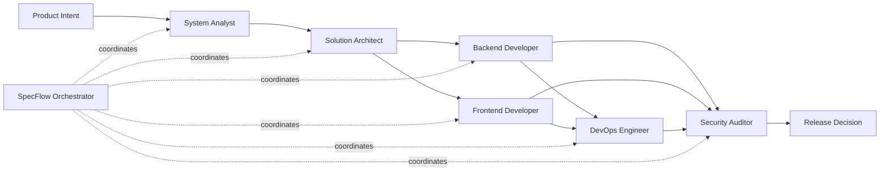

# Agent and Skill Selection Guide

Use this guide to choose the right agent, skill, and MCP integration for common AI-assisted engineering tasks. Agents describe the role or perspective. Skills describe reusable technical capability. MCP integrations provide governed access to external systems.

## Selection Principles

- Start with the outcome: requirement, design, code, test, review, deployment, or operations.
- Use one primary agent to keep accountability clear.
- Add a skill when the task requires domain-specific technical guidance.
- Add MCP only when external context or tool access is needed.
- Use the Security Auditor or explicit approval gates for high-risk changes.

## Scope Boundaries

Agents, skills, and MCP integrations are related, but they should not be treated as interchangeable.

| Component | Scope | Owns | Does Not Own |
| --- | --- | --- | --- |
| Agent | Role, responsibility, collaboration style, and review focus | How a task is approached from a delivery persona | Tool permissions, final decisions, production approval |
| Skill | Reusable technical capability, method, or domain procedure | How to perform specialized work consistently | Business priority, access grants, release approval |
| MCP integration | Governed access to an external system or tool | What context or actions an AI workflow can reach | Interpretation of policy, human approval, unrestricted access |
| CLAUDE.md or project instructions | Repository-specific standards and constraints | Local conventions, commands, guardrails, architecture notes | Organization-wide policy exceptions |
| Human owner | Accountability for the work | Final judgment, approval, risk acceptance | Automated execution without evidence |

Use the narrowest component that solves the task. For example, use the Backend Developer agent for the implementation role, the .NET Enterprise API skill for technical guidance, and GitHub MCP only if repository or pull request context is needed.

## Precedence Order

When instructions conflict, apply this precedence from highest to lowest:

| Priority | Source | Example |
| --- | --- | --- |
| 1 | Organization policy, security policy, legal, and compliance requirements | Do not send regulated data to unapproved tools |
| 2 | Human instruction from the accountable owner or reviewer | Limit this change to documentation only |
| 3 | Repository instructions such as `CLAUDE.md` and contribution standards | Run `mkdocs build --strict` before publishing docs |
| 4 | Approved workflow templates and AITMPL task instructions | Use the team PR summary template |
| 5 | Agent role guidance | Backend Developer should add tests for API changes |
| 6 | Skill guidance | Terraform Expert should review state and plan safety |
| 7 | MCP tool output or external context | GitHub MCP reports the latest CI failure log |
| 8 | General model knowledge | Common framework or language knowledge |

MCP output can provide current facts, but it does not override policy, repository standards, or human approval gates. If two instructions conflict, stop and ask the accountable human owner rather than blending them silently.
## Common Task Mapping

| Task | Primary Agent | Supporting Skill | Useful MCP |
| --- | --- | --- | --- |
| Clarify feature requirements | System Analyst | GitHub Spec Kit | GitHub |
| Break an epic into delivery tasks | SpecFlow Orchestrator | GitHub Spec Kit | GitHub |
| Design a cross-service change | Solution Architect | Platform Engineering | GitHub, Context7 |
| Build a backend API endpoint | Backend Developer | .NET Enterprise API | GitHub, Context7 |
| Build a React workflow | Frontend Developer | React Enterprise | GitHub, Context7 |
| Review AWS architecture | Solution Architect | AWS Architect | AWS |
| Review Terraform changes | DevOps Engineer | Terraform Expert | Terraform, AWS |
| Investigate CI failure | DevOps Engineer | Platform Engineering | GitHub |
| Review authentication or authorization | Security Auditor | .NET Enterprise API | GitHub |
| Prepare deployment notes | DevOps Engineer | Platform Engineering | GitHub, AWS |
| Improve platform standards | Platform Architect | Platform Engineering | GitHub |
| Create release documentation | SpecFlow Orchestrator | GitHub Spec Kit | GitHub |

## Choosing Between Agent Types

| Need | Use |
| --- | --- |
| A human-like delivery role with responsibilities and review focus | Agent |
| A reusable technical capability or domain procedure | Skill |
| Coordination across multiple agents and stages | Orchestrator |
| External system context such as repos, cloud, docs, or CI | MCP |

## Handoff Diagram

## Recommended Handoff Pattern

For multi-step feature work, use this sequence:

1. System Analyst clarifies requirements, assumptions, and acceptance criteria.
2. Solution Architect defines design choices, boundaries, and trade-offs.
3. Backend Developer and Frontend Developer implement the selected slice.
4. DevOps Engineer prepares deployment, validation, and runbook updates.
5. Security Auditor reviews high-risk behavior before release.
6. SpecFlow Orchestrator summarizes traceability from requirement to validation.

## Review Questions

Before starting, ask:

- Is the requirement clear enough for implementation?
- Which human owner is accountable for the result?
- Which agent should lead the task?
- Which skill provides the necessary technical standard?
- Is MCP access needed, and is the permission profile appropriate?
- Which approval gate applies before merge or release?

---
*Last updated: 2026-06-21 | Version: 1.2*