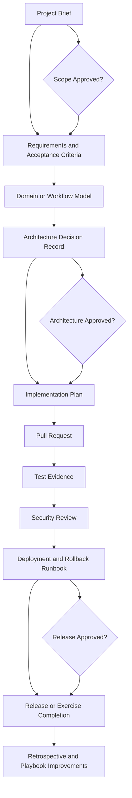

# Reference Project Implementation Guide

This guide explains how teams should use the reference projects as sample delivery workflows, not only as architecture examples. Each reference project can be used for onboarding, delivery rehearsal, tool validation, governance review, or as a starting point for a real implementation.

## Purpose

Reference projects help teams practice AI-assisted delivery in a controlled, repeatable way. They show how agents, skills, MCP integrations, human approvals, and engineering standards work together across a realistic project lifecycle.

Use this guide when a team needs to:

- Learn the AI engineering workflow with a concrete example.
- Validate agents, skills, and MCP setup before using them on production work.
- Produce consistent implementation artifacts.
- Practice approval gates and human-in-the-loop review.
- Compare delivery quality across teams or tools.

## How to Use This Guide

1. Choose one reference project and confirm whether the work is a training exercise or a real delivery effort.
2. Use the implementation workflow to plan the delivery sequence and approval points.
3. Assign human owners and AI agents using the collaboration pattern.
4. Produce the required artifacts as the project progresses.
5. Use the completion checklist and project-specific definition of done before closing the work.

## Delivery Modes

| Mode | When to Use | Governance Level | Expected Outcome |
| --- | --- | --- | --- |
| Training exercise | Onboarding, team enablement, tool validation, delivery rehearsal | Lightweight review, sample data, limited environment access | Shared understanding of the workflow and improvement actions |
| Delivery implementation | Real backlog item, customer-facing feature, production platform work | Formal approval gates, traceable decisions, reviewed changes | Production-ready implementation with evidence and ownership |

## Reference Project Workflow Diagram



## Implementation Workflow

| Stage | Inputs | AI-Assisted Activities | Human Responsibilities | Outputs | Approval Gate |
| --- | --- | --- | --- | --- | --- |
| 1. Project framing | Business goal, reference project page, constraints | Summarize scenario, identify scope, draft assumptions | Confirm business objective, scope, and constraints | Project brief, assumptions log | Product or engineering lead approval |
| 2. Requirements | User roles, workflows, policies, examples | Draft user stories, acceptance criteria, edge cases | Validate business rules and priority | Requirements specification, acceptance criteria | Product owner approval |
| 3. Analysis | Requirements, domain concepts, integrations | Identify entities, states, transitions, risks | Resolve ambiguous rules and integration ownership | Domain model, workflow model, risk register | Analyst or architect approval |
| 4. Architecture | Analysis outputs, platform standards, security requirements | Propose architecture, API boundaries, data model, deployment pattern | Select architecture, review trade-offs, approve standards | Architecture decision records, diagrams, API contracts | Architecture review |
| 5. Implementation planning | Architecture, backlog, team capacity | Break work into tasks, map agents and skills, draft sequence | Confirm sprint or iteration plan | Implementation plan, task list, responsibility matrix | Delivery lead approval |
| 6. Development | Tasks, repository standards, coding conventions | Generate code drafts, tests, documentation updates | Review code, refine implementation, own final changes | Application code, tests, docs | Pull request review |
| 7. Verification | Acceptance criteria, test strategy, security checklist | Draft test cases, inspect failures, propose fixes | Run tests, validate behavior, approve fixes | Test results, defect log, security notes | QA and security approval |
| 8. Deployment | Release plan, infrastructure, environment config | Draft deployment steps, rollback plan, runbook | Execute or approve deployment, monitor outcome | Release notes, deployment log, runbook | Release approval |
| 9. Operations | Monitoring data, incidents, feedback | Summarize signals, suggest improvements, update docs | Own operations, incidents, and prioritization | Operational review, backlog updates | Service owner review |

## Repository Workflow

Use a normal engineering workflow even when AI produces a large portion of the draft content:

1. Create a feature branch for the reference project implementation.
2. Open a draft pull request early so design notes, assumptions, and generated artifacts are visible.
3. Commit generated code and documentation in reviewable increments.
4. Attach or link requirements, architecture notes, test evidence, and security findings to the pull request.
5. Require human review for code, tests, infrastructure, security-sensitive behavior, and documentation.
6. Merge only after approval gates pass and the completion checklist is satisfied.

## Workflow Scope and Precedence

For reference projects, define the scope of each AI component before implementation starts.

| Decision | Recommended Practice |
| --- | --- |
| Agent scope | Assign one primary agent per stage so responsibility stays clear |
| Skill scope | Use skills for technical standards, patterns, and review methods, not for business approval |
| MCP scope | Enable only the integrations needed for the stage and start with read-only access |
| Prompt scope | Keep prompts tied to the selected reference project, selected slice, and current artifact |
| Human scope | Keep final decisions, approvals, and risk acceptance with named human owners |

Use this precedence order during a reference project:

1. Organization policy and project governance.
2. Human owner direction and approval gates.
3. Repository instructions such as `CLAUDE.md`.
4. Reference project guide and implementation workflow.
5. Selected agent role guidance.
6. Selected skill guidance.
7. MCP output and external tool context.
8. General model knowledge.

If an agent, skill, MCP result, or generated suggestion conflicts with the approved scope, pause and resolve the conflict with the human owner before continuing.
## Agent Collaboration Pattern

Use the agents as a delivery team with clear handoffs:

| Agent | Primary Role | Typical Inputs | Expected Deliverables |
| --- | --- | --- | --- |
| Product Manager Agent | Clarifies product intent and prioritization | Business objective, user needs, constraints | Project brief, priorities, release scope |
| System Analyst Agent | Converts business goals into precise requirements | Project brief, domain examples, policies | User stories, acceptance criteria, domain rules |
| Solution Architect Agent | Defines system structure and trade-offs | Requirements, platform standards, non-functional requirements | Architecture overview, ADRs, API and data boundaries |
| Backend Developer Agent | Implements server-side behavior | API contracts, data model, coding standards | APIs, services, persistence logic, backend tests |
| Frontend Developer Agent | Implements user-facing workflow | UX requirements, API contracts, design standards | Screens, forms, state handling, frontend tests |
| DevOps Engineer Agent | Implements delivery and operations flow | Architecture, deployment target, environment rules | CI/CD updates, runbook, monitoring and rollback guidance |
| Security Auditor Agent | Reviews risk and control coverage | Architecture, implementation, secrets, identity model | Security findings, mitigation checklist, approval notes |

## MCP Usage Examples

MCP integrations should be used where they improve context, traceability, or automation. Access should follow the security guidance in the MCP setup documentation.

| Stage | Useful MCP | Example Use |
| --- | --- | --- |
| Requirements | GitHub MCP | Read issues, inspect project backlog, link requirements to pull requests |
| Architecture | Context7 MCP | Retrieve current framework or library documentation while drafting decisions |
| Infrastructure | Terraform MCP, AWS MCP | Inspect modules, validate infrastructure assumptions, review cloud resources |
| Development | GitHub MCP, Context7 MCP | Review repository conventions, reference APIs, prepare implementation notes |
| Deployment | GitHub MCP, AWS MCP, Kubernetes MCP | Review pipeline status, deployment history, runtime configuration, release evidence |
| Operations | AWS MCP, Kubernetes MCP, monitoring-related MCPs | Inspect operational state, summarize incidents, support runbook updates |

## Sample Workflow by Reference Project

| Reference Project | Recommended Starting Point | Key Workflow Focus | Critical Review Areas |
| --- | --- | --- | --- |
| Product Management | Define product lifecycle, category model, pricing rules, and approval states | Requirements -> domain analysis -> API and UI implementation | Price precision, approval transitions, audit logging, downstream integration behavior |
| Authentication & RBAC | Define actors, roles, permissions, identity provider assumptions, and protected actions | Security model -> architecture -> negative testing | Default-deny behavior, token validation, privilege escalation, tenant isolation, audit coverage |
| AWS EC2 Hosted App | Define workload, network exposure, deployment flow, and operational ownership | Architecture -> infrastructure -> deployment -> operations | IAM scope, network access, patching, secrets, rollback, monitoring, backup and restore |

## Definition of Done by Reference Project

| Reference Project | Done Means |
| --- | --- |
| Product Management | Product, category, pricing, and lifecycle workflows are implemented or documented; approval state transitions are tested; audit logging is captured; integration behavior is described. |
| Authentication & RBAC | Authentication flow is documented; protected routes and endpoints enforce default-deny behavior; allowed and denied access tests pass; token and claim handling is reviewed. |
| AWS EC2 Hosted App | Infrastructure design is documented; deployment and rollback are tested or rehearsed; monitoring and alarms are defined; access, patching, backup, and secrets handling are reviewed. |

## Required Artifacts

Each reference project implementation should produce:

- Project brief.
- Requirements specification.
- Acceptance criteria.
- Domain or workflow model.
- Architecture overview.
- Architecture decision records for major trade-offs.
- API or interface contracts.
- Implementation task plan.
- Test plan and test results.
- Security review checklist.
- Deployment and rollback runbook.
- Operational monitoring notes.
- Release notes.

## Artifact Templates

Use lightweight templates unless the team already has standard formats.

### Project Brief

```md
# Project Brief

## Objective

## Scope

## Out of Scope

## Assumptions

## Constraints

## Success Criteria
```

### Requirement

```md
# Requirement

## User or Actor

## Need

## Business Rule

## Acceptance Criteria

## Edge Cases
```

### Architecture Decision Record

```md
# ADR: <Decision Title>

## Context

## Decision

## Alternatives Considered

## Consequences

## Review Date
```

### Test Plan

```md
# Test Plan

## Scope

## Test Cases

## Negative Tests

## Automation Coverage

## Evidence
```

### Security Review

```md
# Security Review

## Sensitive Data

## Access Control

## Secret Handling

## Audit Logging

## Findings

## Required Mitigations
```

### Deployment Runbook

```md
# Deployment Runbook

## Preconditions

## Deployment Steps

## Verification Steps

## Rollback Steps

## Owner
```

## Filled Examples

The templates above are starting points. Below are completed examples using the Product Management reference project as the domain. Use these as a reference when filling in your own artifacts.

### Completed Project Brief

```md
# Project Brief: Product Catalog Management

## Objective
Enable product managers to create, update, and publish product records
through a self-service web interface with approval workflows.

## Scope
- Product CRUD operations with category and pricing
- Approval workflow for publishing to customer-facing catalog
- Audit logging for all product changes

## Out of Scope
- Inventory management (handled by warehouse system)
- Order processing (handled by order service)
- Customer-facing catalog rendering (handled by storefront)

## Assumptions
- Product managers are authenticated via existing SSO
- Category taxonomy is managed separately
- Price changes require approval from a pricing manager

## Constraints
- Must integrate with existing product database
- API must follow company REST standards
- Launch deadline: end of Q3

## Success Criteria
- Product managers can create and publish products without developer help
- All changes are auditable
- Approval workflow reduces publishing errors by 50%
```

### Completed Requirement

```md
# Requirement: Bulk Product Import

## User or Actor
Product Manager (admin role)

## Need
Import up to 1000 products from a CSV file so that catalog updates
are efficient during seasonal refreshes.

## Business Rule
- Each row must have: Name, SKU, Price, CategoryId
- Duplicate SKUs are rejected with a clear error message
- Imported products start in "Draft" status
- Price must be positive with max 2 decimal places

## Acceptance Criteria
- Given a valid CSV with 50 products, when I upload it, then all 50
  appear in "Draft" status with correct data
- Given a CSV with 2 duplicate SKUs, when I upload it, then I see
  an error listing the duplicate rows and no products are created
- Given a CSV with a missing required column, when I upload it,
  then I see a clear error explaining which column is missing

## Edge Cases
- CSV with 0 data rows (only headers)
- CSV with special characters in product names
- CSV file larger than 10MB (should reject with size limit message)
```

### Completed Architecture Decision Record

```md
# ADR: Use Cursor-Based Pagination for Product Listing

## Context
The product listing API currently returns all products in a single
response. With 10,000+ products, this causes slow response times and
memory issues. We need pagination.

## Decision
Use cursor-based pagination (after/limit) instead of offset pagination.
The cursor is the last product ID from the previous page.

## Alternatives Considered
- Offset pagination (LIMIT/OFFSET): Simpler but degrades at high offsets
  because the database must scan and skip rows
- Page-number pagination: User-friendly but has the same performance
  issue as offset at high page numbers

## Consequences
- Better performance for deep pagination
- Clients cannot jump to arbitrary pages (acceptable for this use case)
- Cursor must be stable (product ID is immutable, so this is safe)
- Need to document the pagination contract in OpenAPI

## Review Date
2026-09-01 (after 3 months of production use)
```

### Completed Test Plan

```md
# Test Plan: Product Bulk Import

## Scope
Integration tests for the POST /api/products/import endpoint.

## Test Cases
1. Valid CSV with 10 products → all created in Draft status
2. Valid CSV with 1000 products → all created, response includes count
3. CSV with header row only → 0 products created, success response
4. CSV with duplicate SKUs → error response listing duplicate rows
5. CSV with missing required column → error explaining which column
6. CSV with invalid price (negative) → error listing invalid rows

## Negative Tests
7. Empty file → 400 Bad Request
8. File larger than 10MB → 413 Payload Too Large
9. Non-CSV file (e.g., .xlsx) → 415 Unsupported Media Type
10. Unauthenticated request → 401 Unauthorized

## Automation Coverage
All 10 test cases will be automated as integration tests using
Testcontainers with a real PostgreSQL database.

## Evidence
Test results will be attached to the pull request as CI output.
```

### Completed Security Review

```md
# Security Review: Product Bulk Import

## Sensitive Data
- Product data is not PII or regulated
- No customer data involved in import
- CSV files are processed in memory, not stored on disk

## Access Control
- Only users with ProductManager role can import
- Endpoint requires authenticated session
- Rate limited to 5 imports per hour per user

## Secret Handling
- No secrets in CSV processing
- No credentials logged during import
- Database connection uses existing connection pool

## Audit Logging
- All import attempts logged (user, timestamp, row count, success/failure)
- Failed imports log the reason (duplicates, validation errors)
- No product data logged in audit trail

## Findings
- [LOW] Import has no idempotency key — re-uploading the same CSV
  creates duplicate Draft products. Recommend adding an idempotency
  header.

## Required Mitigations
- Add idempotency key support before production release
- Confirm rate limiting is enforced in staging
```

### Completed Deployment Runbook

```md
# Deployment Runbook: Product Bulk Import Feature

## Preconditions
- Database migration 20260621_add_import_columns has been applied
- Feature flag PRODUCT_IMPORT_ENABLED is set to false in production
- Staging tests passing with all 10 test cases

## Deployment Steps
1. Merge PR to main
2. CI builds and deploys to staging automatically
3. Run smoke test: POST /api/products/import with test CSV
4. Verify audit log entries in staging
5. Enable feature flag PRODUCT_IMPORT_ENABLED in production
6. Monitor error rates and response times for 30 minutes

## Verification Steps
1. Import a test CSV in staging → confirm products created
2. Check audit log → confirm entries present
3. Verify rate limiting → 6th request returns 429
4. Check monitoring → no error spike after deployment

## Rollback Steps
1. Disable feature flag PRODUCT_IMPORT_ENABLED
2. If database migration caused issues, run rollback migration
3. Verify previous import endpoint behavior restored

## Owner
DevOps Engineer (deployment), Backend Developer (feature verification)
```

## Human-in-the-Loop Controls

AI may assist with drafts, analysis, code generation, test design, and documentation, but humans remain accountable for correctness, security, and delivery decisions. Apply these controls:

- Business scope is approved before implementation begins.
- Architecture decisions are reviewed before code generation at scale.
- Security-sensitive changes receive explicit security review.
- Infrastructure and deployment changes require environment owner approval.
- Generated code is treated as untrusted until reviewed and tested.
- Secrets are never pasted into prompts, docs, generated examples, or agent context.
- AI-produced documentation is reviewed for accuracy before publication.

## Team Exercise Format

A reference project can be run as a short team exercise:

| Timebox | Activity | Outcome |
| --- | --- | --- |
| 30-60 minutes | Project framing and requirement discovery | Shared scope and assumptions |
| 60-90 minutes | Analysis and architecture | Domain model, architecture approach, review questions |
| 1-2 days | Implementation slice | Working vertical slice with tests |
| 1 hour | Security and quality review | Findings, mitigations, release decision |
| 30 minutes | Retrospective | Improvements to prompts, agents, standards, and workflow |

## Completion Checklist

Before considering a reference project complete, confirm that:

- Requirements and acceptance criteria are documented.
- Architecture choices and trade-offs are visible.
- Code changes are reviewed by humans.
- Tests cover expected and negative paths.
- Security and access-control concerns are reviewed.
- Deployment and rollback steps are documented.
- Operational ownership is clear.
- Lessons learned are added back to the playbook or team standards.

---
*Last updated: 2026-06-21 | Version: 1.3*