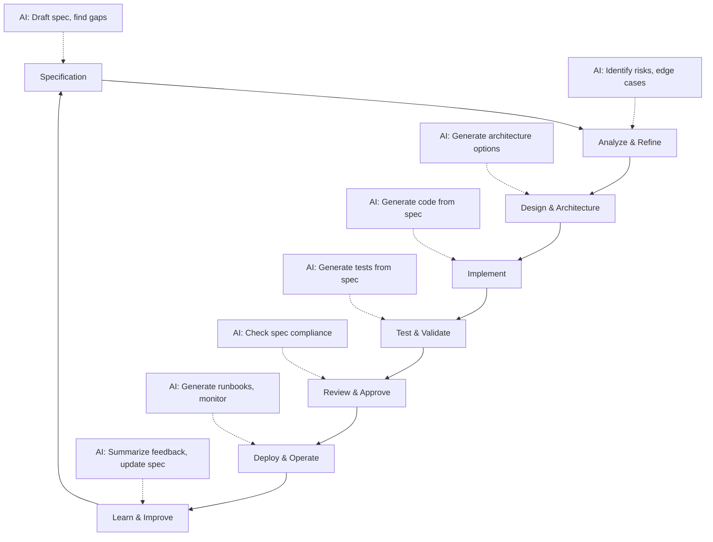
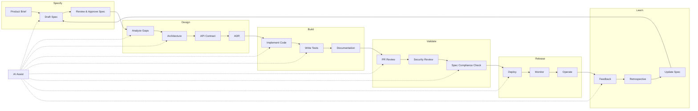

# Spec-Driven Software Development Lifecycle with AI Assist

Spec-driven development is a practice where a specification (spec) is written before implementation. The spec defines what the system should do, how it should behave, and what constraints apply. AI assists at every stage — drafting specs, analyzing gaps, generating code, writing tests, and validating compliance.

This page explains the full lifecycle, shows how AI fits into each phase, and gives an honest assessment of the pros and cons.

## The Core Idea

Traditional development often starts with code. Spec-driven development starts with a document that captures intent before any implementation begins. The spec becomes the contract between product, engineering, and quality.

With AI assist, the spec is not just documentation — it is the input that drives generation, validation, and review throughout the lifecycle.



## Lifecycle Phases

### Phase 1: Specification

**What happens:** A product owner, analyst, or engineer writes a specification that defines the desired behavior. The spec includes user stories, acceptance criteria, business rules, constraints, and edge cases.

**AI assist:**
- Draft spec from a product brief or feature request
- Identify missing acceptance criteria
- Suggest edge cases based on similar patterns
- Generate user story variations
- Check for ambiguity or contradictions

**Human role:** Validate the spec reflects real business intent. Confirm scope, priorities, and constraints. Approve before implementation begins.

**Artifacts:**
- Product specification
- User stories with acceptance criteria
- Business rules and constraints
- Edge cases and error scenarios
- Out-of-scope declarations

**Example prompt:**
```
Draft a specification for a bulk product import feature.
Include: user stories, acceptance criteria, business rules,
edge cases, and out-of-scope items. Flag any ambiguity you find.
```

### Phase 2: Analysis & Refinement

**What happens:** The spec is analyzed for completeness, consistency, and feasibility. Analysts identify gaps, resolve contradictions, and confirm assumptions with stakeholders.

**AI assist:**
- Analyze spec for missing scenarios
- Identify conflicts between business rules
- Map requirements to affected systems
- Generate questions for stakeholders
- Create domain models from requirements

**Human role:** Resolve ambiguity. Make decisions on trade-offs. Confirm assumptions with business stakeholders.

**Artifacts:**
- Gap analysis
- Resolved questions and decisions
- Domain model
- Affected systems map
- Risk register

**Example prompt:**
```
Analyze this specification for gaps and contradictions.
Identify missing acceptance criteria, conflicting rules,
and any assumptions that need stakeholder confirmation.
Present as a numbered list with severity (critical/high/low).
```

### Phase 3: Design & Architecture

**What happens:** Architects and engineers design the solution. They define service boundaries, API contracts, data models, integration patterns, and deployment architecture.

**AI assist:**
- Generate architecture options with trade-offs
- Draft API contracts from requirements
- Propose data models
- Identify integration points
- Generate architecture decision records (ADRs)

**Human role:** Select the architecture approach. Approve trade-offs. Confirm alignment with platform standards.

**Artifacts:**
- Architecture overview
- API contracts (OpenAPI)
- Data model
- ADRs for major decisions
- Sequence diagrams

**Example prompt:**
```
Design the architecture for this spec. Provide:
- 2 architecture options with trade-offs
- API contract (OpenAPI) for the primary endpoints
- Data model with relationships
- Integration points with existing systems
- Recommended approach with justification
```

### Phase 4: Implementation

**What happens:** Engineers write the code. The spec drives what gets built — every feature maps back to a spec requirement.

**AI assist:**
- Generate code from the spec and API contract
- Follow project conventions from CLAUDE.md
- Implement validation rules from business rules
- Generate migration scripts from data model
- Suggest implementation patterns

**Human role:** Review generated code. Ensure it follows conventions. Verify it actually implements the spec. Own the final code.

**Artifacts:**
- Implementation code
- Database migrations
- Configuration changes
- Documentation updates

**Example prompt:**
```
Implement the POST /api/products/import endpoint based on this spec:
- Accept CSV with Name, SKU, Price, CategoryId
- Validate each row, reject duplicates, return errors for invalid rows
- Create products in Draft status
- Write audit log entry
- Follow patterns in src/Services/

Run tests after implementation.
```

### Phase 5: Test & Validate

**What happens:** Tests are written to verify the implementation matches the spec. Every acceptance criterion should have at least one test.

**AI assist:**
- Generate test cases from acceptance criteria
- Generate negative tests from edge cases
- Identify untested scenarios
- Generate test data
- Run tests and analyze failures

**Human role:** Verify tests are meaningful, not just passing. Confirm edge cases are covered. Own test quality.

**Artifacts:**
- Test plan
- Unit tests
- Integration tests
- Contract tests
- Test results and coverage

**Example prompt:**
```
Generate integration tests for the bulk import endpoint.
Cover every acceptance criterion from the spec:
- Valid CSV with 50 products → all created
- Duplicate SKUs → error listing duplicates
- Missing column → clear error message
- Empty file → 400 Bad Request
- File > 10MB → 413 Payload Too Large

Use Testcontainers with PostgreSQL. Follow existing test patterns.
```

### Phase 6: Review & Approve

**What happens:** The implementation is reviewed against the spec. Reviewers check that code matches requirements, tests cover scenarios, and security is addressed.

**AI assist:**
- Check implementation against spec compliance
- Identify unimplemented requirements
- Review for security concerns
- Generate PR summary linking to spec
- Flag deviations from spec

**Human role:** Approve the implementation. Make judgment calls on edge cases. Sign off on security and quality.

**Artifacts:**
- PR description with spec references
- Review comments
- Security review findings
- Approval decisions

**Example prompt:**
```
Review this PR against the specification.
Check: does the implementation cover all acceptance criteria?
Are all edge cases handled? Are there any deviations from spec?
Flag with severity and suggest fixes.
```

### Phase 7: Deploy & Operate

**What happens:** The feature is deployed to production. Operations teams monitor behavior, handle incidents, and ensure the feature works as specified in production.

**AI assist:**
- Generate deployment runbook from spec
- Generate monitoring rules from acceptance criteria
- Summarize production logs and metrics
- Draft incident response procedures
- Generate rollback plans

**Human role:** Approve deployment. Monitor production. Respond to incidents. Own operational decisions.

**Artifacts:**
- Deployment runbook
- Monitoring dashboards
- Alert rules
- Rollback procedure
- Incident response notes

**Example prompt:**
```
Generate a deployment runbook for this feature.
Include: preconditions, deployment steps, verification steps,
rollback steps, and monitoring rules based on the acceptance criteria.
```

### Phase 8: Learn & Improve

**What happens:** After deployment, the team reflects on what worked, what didn't, and what should change. Feedback flows back into the spec for the next iteration.

**AI assist:**
- Summarize production feedback
- Identify spec gaps found in production
- Suggest spec improvements
- Generate retrospective notes
- Update documentation

**Human role:** Decide what to change. Prioritize improvements. Update the spec.

**Artifacts:**
- Retrospective notes
- Updated specification
- Backlog items for next iteration
- Documentation updates

**Example prompt:**
```
Summarize production feedback for this feature.
What acceptance criteria were met? What issues were found?
What should we add to the spec for the next iteration?
```

## Full Lifecycle Diagram



## Agent Mapping

Each phase maps to specific agents and skills:

| Phase | Primary Agent | Supporting Skill | MCP |
|-------|---------------|------------------|-----|
| Specification | System Analyst | GitHub Spec Kit | GitHub |
| Analysis | System Analyst | — | GitHub, Context7 |
| Design | Solution Architect | AWS Architect, Platform Engineering | Context7 |
| Implementation | Backend Developer, Frontend Developer | .NET Enterprise API, React Enterprise | GitHub, Context7 |
| Testing | Backend Developer, Frontend Developer | — | GitHub |
| Review | Security Auditor | — | GitHub |
| Deployment | DevOps Engineer | Terraform Expert, AWS Architect | GitHub, AWS, Docker |
| Learning | SpecFlow Orchestrator | GitHub Spec Kit | GitHub |

## Pros and Cons

### Pros

| Advantage | Explanation |
|-----------|-------------|
| **Clear requirements before coding** | Engineers know what to build before they start. Reduces rework from misunderstood requirements. |
| **AI generates better output from specs** | AI code generation is significantly better when it has a clear spec to work from. Vague prompts produce vague code. |
| **Testable by design** | Acceptance criteria in the spec become test cases. Every requirement has a corresponding validation. |
| **Traceability** | Every code change traces back to a spec requirement. Reviewers can verify compliance, not just code quality. |
| **Better reviews** | Reviewers check "does this match the spec?" instead of "is this code good?" — a more objective standard. |
| **Reduced ambiguity** | Writing a spec forces decisions before implementation. Ambiguity is resolved in the spec, not in code. |
| **Parallel work** | Multiple engineers can implement from the same spec without stepping on each other. |
| **Knowledge preservation** | The spec captures intent. New team members can understand why something was built, not just what. |
| **AI-assisted gap analysis** | AI can find missing scenarios, edge cases, and contradictions in a spec that humans miss. |
| **Repeatable workflow** | The same lifecycle applies to every feature. Teams develop muscle memory. |

### Cons

| Disadvantage | Explanation |
|--------------|-------------|
| **Upfront time investment** | Writing a spec takes time before any code is written. For small changes, this overhead may not be worth it. |
| **Spec can become stale** | If the spec isn't updated when requirements change, it becomes a liability instead of an asset. |
| **Over-specification risk** | Too much detail in the spec can constrain implementation flexibility and slow down engineers. |
| **AI can produce plausible but wrong specs** | AI-generated specs may look complete but miss domain nuances. Human validation is essential. |
| **Requires discipline** | The team must commit to writing specs, keeping them updated, and referencing them in reviews. This is cultural, not just process. |
| **Not ideal for exploration** | When the problem is unclear (spikes, prototypes, research), a spec-driven approach adds unnecessary overhead. |
| **Can feel bureaucratic** | If the process is too rigid, developers may see it as paperwork rather than a useful tool. |
| **Spec-to-code drift** | Over time, the implementation may diverge from the spec. Without enforcement, the spec becomes fiction. |
| **AI over-reliance risk** | Teams may trust AI-generated specs or code without sufficient review, leading to subtle bugs. |
| **Learning curve** | Writing good specs is a skill. Junior team members may struggle to write useful specifications. |

## When to Use Spec-Driven Development

| Situation | Recommended? | Why |
|-----------|--------------|-----|
| New feature with clear requirements | ✅ Yes | Spec captures intent before implementation |
| Cross-service change | ✅ Yes | Spec coordinates multiple teams |
| Security-sensitive feature | ✅ Yes | Spec defines security requirements upfront |
| API design | ✅ Yes | Spec becomes the API contract |
| Bug fix (clear cause) | ⚠️ Maybe | A short spec may help, but not always necessary |
| Bug fix (unclear cause) | ❌ No | Exploration first, spec later if needed |
| Spike or prototype | ❌ No | Goal is learning, not delivery |
| Small UI tweak | ❌ No | Overhead exceeds value |
| Production incident | ❌ No | Speed matters more than process |

## Lightweight vs. Full Spec

Not every feature needs a full spec. Use this guide to choose:

### Lightweight Spec (1-2 pages)

For small features, bug fixes, or internal tools:

```markdown
# Feature: <name>

## What
One paragraph describing the feature.

## Acceptance Criteria
- Criterion 1
- Criterion 2
- Criterion 3

## Out of Scope
- What this feature does NOT do
```

### Full Spec (3-10 pages)

For customer-facing features, cross-service changes, or security-sensitive work:

```markdown
# Specification: <name>

## Overview
## User Stories
## Acceptance Criteria
## Business Rules
## Edge Cases
## Data Model
## API Contract
## Security Requirements
## Performance Requirements
## Out of Scope
## Open Questions
```

### Decision Guide

| Factor | Lightweight | Full |
|--------|-------------|------|
| Scope | Single service, single team | Cross-service, multiple teams |
| Risk | Low (internal tool, non-critical) | High (customer-facing, security) |
| Duration | Hours to days | Days to weeks |
| Reviewers | 1-2 people | 3+ people including security |
| AI usage | Simple prompts | Full lifecycle with agents |

## Example: Full Lifecycle Walkthrough

**Feature:** Bulk product import via CSV

### Spec (Phase 1)
```markdown
# Bulk Product Import

## User Story
As a product manager, I can import products from CSV so that
catalog updates are efficient during seasonal refreshes.

## Acceptance Criteria
- Upload CSV with Name, SKU, Price, CategoryId
- Duplicate SKUs rejected with error listing
- Missing required column returns clear error
- Products created in Draft status
- Audit log entry for each import

## Edge Cases
- Empty CSV (headers only)
- CSV with special characters
- File > 10MB rejected
```

### Design (Phase 3)
```markdown
# ADR: Cursor-based pagination for product listing

## Context
Product listing returns all records. Need pagination for 10K+ products.

## Decision
Use cursor-based pagination (after/limit) with product ID as cursor.

## Consequences
- Better performance at high offsets
- Clients cannot jump to arbitrary pages
- Need OpenAPI documentation update
```

### Test (Phase 5)
```markdown
# Test Plan: Bulk Import

## Test Cases
1. Valid CSV, 50 products → all created in Draft
2. Duplicate SKUs → error listing duplicates
3. Missing column → clear error message
4. Empty file → 400
5. File > 10MB → 413
```

### Deployment (Phase 7)
```markdown
# Deployment Runbook

## Steps
1. Apply migration 20260621_add_import_columns
2. Deploy to staging
3. Run smoke test with test CSV
4. Enable feature flag in production
5. Monitor for 30 minutes

## Rollback
1. Disable feature flag
2. Run rollback migration if needed
```

## Related Pages

- [Introduction](../01-governance/introduction.md) — operating model principles
- [System Analyst](../03-agents/system-analyst.md) — spec drafting agent
- [Solution Architect](../03-agents/solution-architect.md) — design agent
- [SpecFlow Orchestrator](../03-agents/specflow-orchestrator.md) — lifecycle coordination
- [Agent and Skill Selection Guide](../03-agents/agent-skill-selection.md) — which agent for each phase
- [Reference Project Implementation Guide](../06-reference-projects/implementation-guide.md) — artifact templates
- [AITMPL](../02-platform-setup/aitmpl.md) — task templates for each phase
- [CLAUDE.md](../02-platform-setup/claude-md.md) — project context for AI

---

*Last updated: 2026-06-21 | Version: 1.3*
